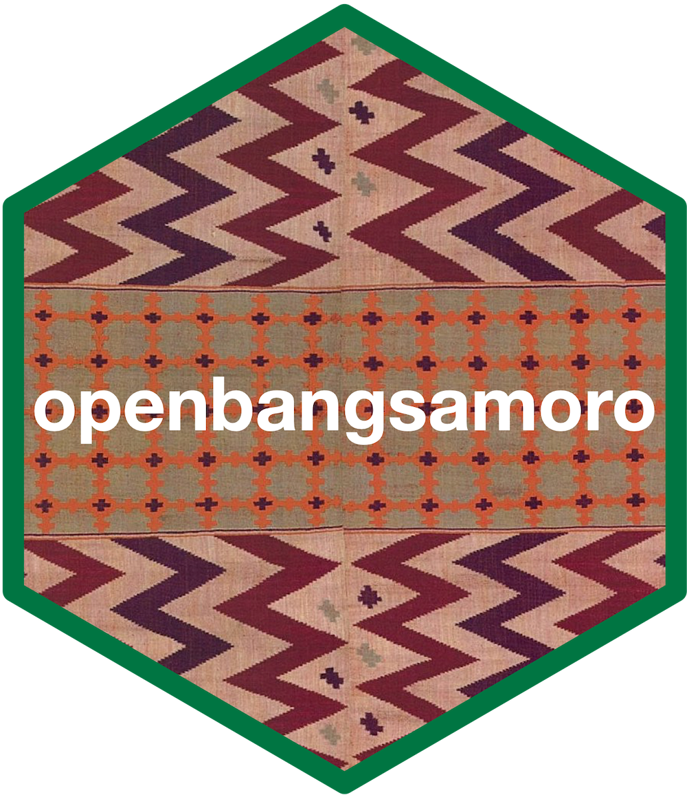

<!-- README.md is generated from README.Rmd. Please edit that file -->

```{r, include = FALSE}
knitr::opts_chunk$set(
  collapse = TRUE,
  comment = "#>",
  fig.path = "man/figures/README-",
  out.width = "100%"
)
```

# openbangsamoro: An Interface to the OpenBangsamoro Database 

<!-- badges: start -->
[](https://www.tidyverse.org/lifecycle/#experimental)
<!-- badges: end -->

The OpenBangsamoro initiative supports the use of open statistical, geospatial, and administrative data for transparent, accountable, and participatory decision-making as the Autonomous Region in Muslim Mindanao (ARMM) transforms into the Bangsamoro Autonomous Region in Muslim Mindanao.

## Installation

<!---
You can install the released version of openbangsamoro from [CRAN](https://CRAN.R-project.org) with:

``` r
install.packages("openbangsamoro")
```
--->

`openbangsamoro` package is not yet available on [CRAN](https://cran.r-projecdt.org).

The development version of the `openbangsamoro` package can be installed from [GitHub](https://github.com/) with:

```{r install, echo = TRUE, eval = FALSE}
if(!require(remotes)) install.packages("remotes")
remotes::install_github("panukatan/openbangsamoro")
```

## Usage

