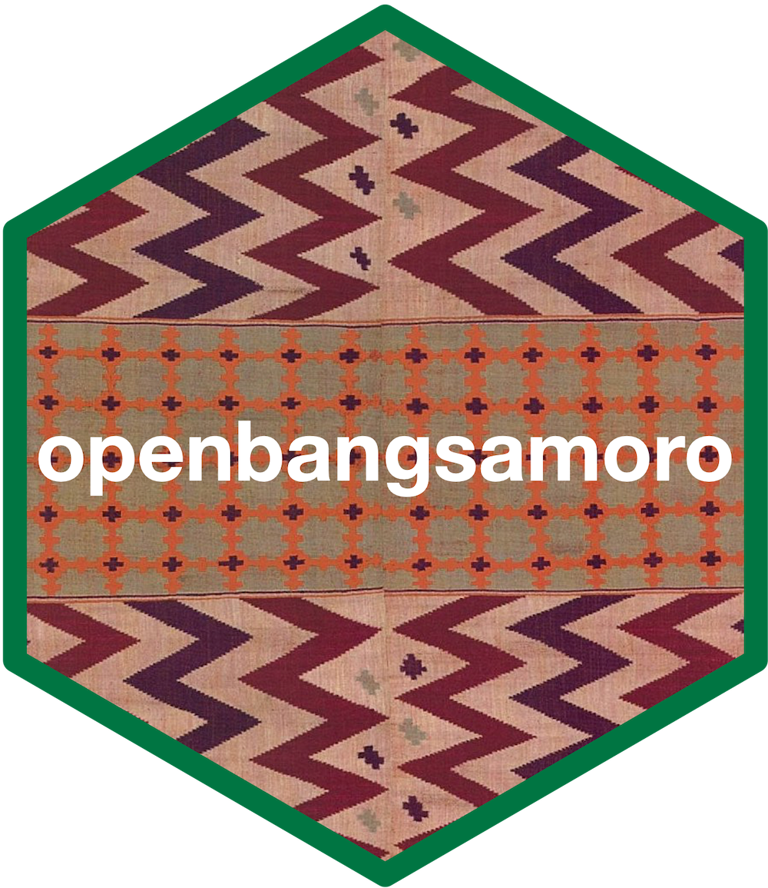

<!-- README.md is generated from README.Rmd. Please edit that file -->

# openbangsamoro: An Interface to the OpenBangsamoro Database 

<!-- badges: start -->

[](https://www.tidyverse.org/lifecycle/#experimental)

<!-- badges: end -->

The OpenBangsamoro initiative supports the use of open statistical,
geospatial, and administrative data for transparent, accountable, and
participatory decision-making as the Autonomous Region in Muslim
Mindanao (ARMM) transforms into the Bangsamoro Autonomous Region in
Muslim Mindanao.

## Installation

<!---
You can install the released version of openbangsamoro from [CRAN](https://CRAN.R-project.org) with:

``` r
install.packages("openbangsamoro")
```
--->

`openbangsamoro` package is not yet available on
[CRAN](https://cran.r-projecdt.org).

The development version of the `openbangsamoro` package can be installed
from [GitHub](https://github.com/) with:

``` r
if(!require(remotes)) install.packages("remotes")
remotes::install_github("panukatan/openbangsamoro")
```

## Usage
